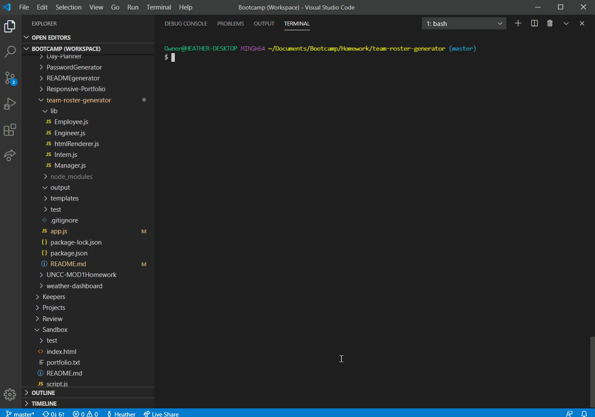
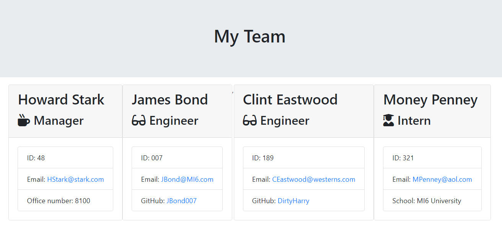

# Team Roster Generator
This Node application utilizes the command line interface which allows the user to create a software engineering team roster page in HTML. The roster page provides a summary of contact information for each team member.

## Installation
There is a `package.json`, so make sure to `npm install`.

The dependencies are, [jest](https://jestjs.io/) for running the provided tests, and [inquirer](https://www.npmjs.com/package/inquirer) for collecting input from the user.

## Usage
This application can be used to create a software engineering team roster page in HTML. The application will prompt the user for information about the team manager and then information about the team members. The user can input any number of team members, and they may be a mix of engineers and interns. When the user has completed building the team, the application will create an HTML file that displays a nicely formatted team roster based on the information provided by the user.

The user needs to be prepared to answer the following questions for each type of team member.

* Every Team Member
    - Name
    - Employee Number
    - Email Address

* Manager
    - Office Number

* Engineer
    - GitHub User Name

* Intern
    - College Name

## Roster output

The application will generate a `team.html` page in the `output` directory, that displays a nicely formatted team roster.

## Screenshots

*Image of Team Roster generated in HTML*

## Questions
If you have any questions about the repo, open an issue or contact [Hlsorrells](github.com/Hlsorrells) directly at [hlsorrells.dev@gmail.com](mailto:hlsorrells.dev@gmail.com).

## Author

[Heather Sorrells](mailto:hlsorrells.dev@gmail.com)